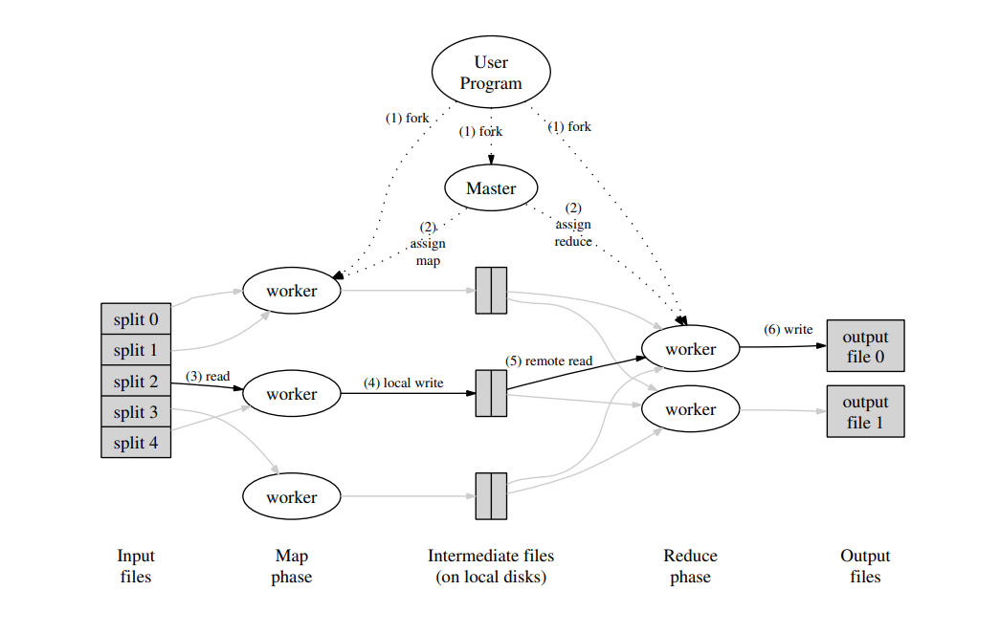
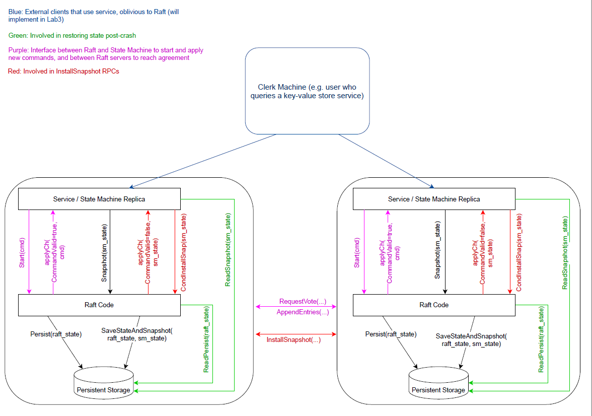
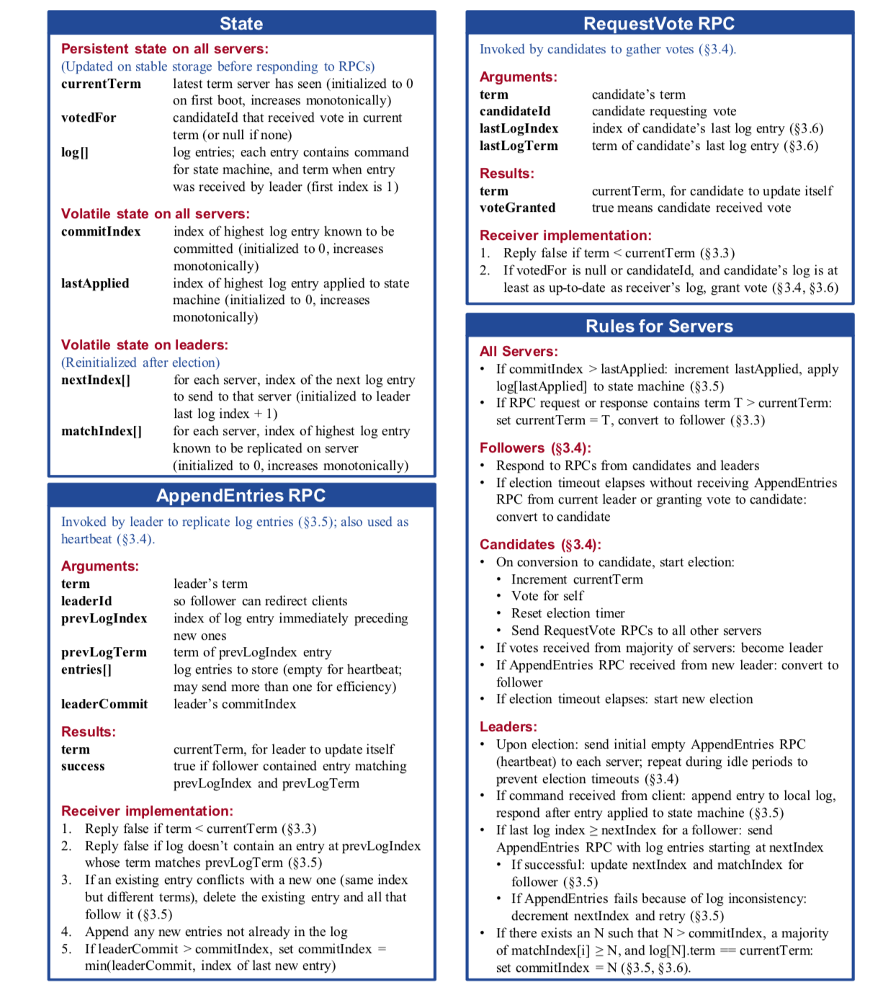
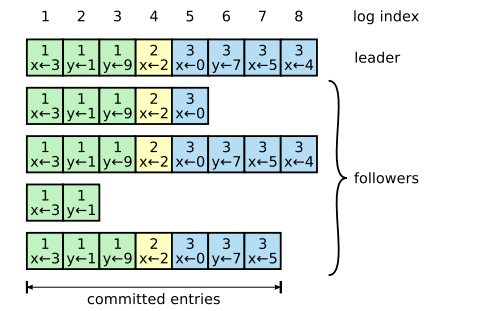

## MapReduce



## Raft共识算法

```go
/// Raft
///----- 核心函数 -----///
Make
- ticker
	- StartElection
		- sendRequestVote RPC-> RequestVote
	- BroadcastHeartbeat
		- replicateOneRound
- replicator
	- replicateOneRound
		+ 发送快照
		- sendInstallSnapshot RPC -> InstallSnapshot
		- handleInstallSnapshotResponse
		+ 发送心跳/日志
		- sendAppendEntries RPC-> AppendEntries
		- handleAppendEntriesResponse
- applier
	- applyCh通道应用到上层状态机

///----- 辅助函数 -----///
// 通用
- ChangeState
- getFirstLog
- getLastLog
- isLogUpToDate
- kill
- killed
- Me

// 领导选举
- genRequestVoteRequest

// 日志复制
- needReplicating
- genAppendEntriesRequest
- matchLog
- advanceCommitIndexForFollower
- advanceCommitIndexForLeader

// 持久化
encodeState
SaveStateAndSnapshot
persist
readPersist

// 日志压缩与快照
genInstallSnapshotRequest

// 外部接口
- Start
	- appendNewEntry
- GetState
- GetRaftStateSize
- HasLogInCurrentTerm
- Snapshot
- CondInstallSnapshot

///----- util.go 工具函数 -----///
- RandomizedElectionTimeout
- StableHeartbeatTimeout
- shrinkEntriesArray
```

### 整体结构

​	分布式共识算法的目的是在**多个机器**上维持**相同状态**，Raft通过维持**日志条目**结构保证一致性，即**保证 log 完全相同地执行到不同服务上的状态机**以产生相同结果。

​	Raft正常工作中所有操作采用类似**两阶段提交**的方式，Leader 在收到来自客户端的请求后并不会执行，只是将其写入自己的日志列表中，然后将该操作发送给所有的 Follower。Follower 在收到请求后也只是写入自己的日志列表中然后回复 Leader，当有超过半数的结点写入后 Leader 才会提交该操作并返回给客户端，同时通知所有其他结点提交该操作。




架构分为客户端、业务状态机、Raft 共识模块、持久化存储四层，且多节点通过 Raft 协议协同，保证分布式一致性。

- **蓝色**：外部客户端，仅与业务状态机交互，对 Raft 共识无感知
- **紫色**：核心接口，包括Raft 与**状态机的交互接口**（启动 / 应用命令、生成 / 应用快照）；Raft 节点**之间的共识接口**（`RequestVote`选举、`AppendEntries`日志复制）。
- **红色**：`InstallSnapshot` RPC 接口。用于 “快照同步”（当日志过多时，用快照代替全量日志复制，优化状态同步效率）。
- **绿色**：崩溃恢复相关。涉及从持久化存储中**读取 / 保存 Raft 状态、状态机状态**，保证节点崩溃后能恢复到一致状态。


### 服务器节点三种状态

- **Leader**：处理所有客户端请求、日志同步、心跳维持领导权。同一时刻最多只能有一个可行的 Leader
- **Follower**：所有服务器的初始状态，功能为：追随领导者，接收领导者日志并实时同步，特性：完全被动的（不发送 RPC，只响应收到的 RPC）
- **Candidate**：用来选举新的 Leader，处于 Leader 和 Follower 之间的暂时状态，如Follower 一定时间内未收到来自Leader的心跳包，Follower会自动切换为Candidate，并开始选举操作，向集群中的其它节点发送投票请求，待收到半数以上的选票时，协调者升级成为领导者。

**状态机转换：**


**各角色规则（代码实现行为）**

> All Servers

- 若`commitIndex > lastApplied`：递增`lastApplied`，将`commitIndex`对应的日志条目**应用到状态机**（状态机是业务逻辑的执行载体，如键值存储）。
- 若 RPC（请求 / 响应）包含`term T > currentTerm`：设置`currentTerm = T`，并**转换为跟随者**（确保自己处于最新任期）。

> 跟随者

- 响应来自候选者、领导者的所有 RPC。
- 若**选举超时**（长时间未收到领导者的 `AppendEntries RPC`），也没有投票给某个候选者，**转换为候选者**（发起新选举）。

> 候选者

- 转换为候选者时，发起选举：
  - 增加`currentTerm`（进入新任期）。
  - 投票给自己（`votedFor = 自己`）。
  - 重置 “选举定时器”（避免重复选举）。
  - 向**所有其他服务器**发送`RequestVote RPC`。
- 若收到**过半数服务器的投票**：**成为领导者**。
- 若收到**新领导者的 `AppendEntries RPC`**：**转换为跟随者**（承认新领导）。
- 若**选举超时**（未收到过半数投票）：**发起新的选举**。

> 领导者

- 当选后，定期向每个服务器发送**空的 AppendEntries RPC**（心跳），防止跟随者超时选举。
- 若收到客户端命令：
  - 先将命令追加到本地日志。
  - 发送`AppendEntries RPC`给所有跟随者，等待复制。
  - 当日志被 “大多数服务器复制” 后，应用到本地状态机，再响应客户端。
- 若`follower的nextIndex ≤ 领导者最后一条日志索引`：
  - 向该跟随者发送`AppendEntries`（包含`nextIndex`开始的日志）。
  - 若复制成功：更新领导者中针对该跟随者的`nextIndex`和`matchIndex`。
- 若`AppendEntries`因**日志不一致**失败：递减该跟随者的`nextIndex`，**重试**（逐步找到 “日志匹配点”，再复制后续条目）。
- 若存在`N`满足：`N > commitIndex`，**且大多数服务器的 matchIndex [i] ≥ N**，**且 log[N].term == currentTerm**：设置`commitIndex = N`（标记该日志为 “已提交”，可应用到状态机）。



### 领导选举

> 任期

​	每个term开始都是leader选举为起点，任期递增条件：一个节点成为candidate发起投票时term+1；在收到比自己更新的term之后转为follower并更新任期（收到过时term消息拒绝该请求）

> 选举

​	follower在election timeout（随机选举超时防止投票分裂）时间内没有收到合法RPC请求（leader发送的AppendEntries 或candidates发送的RequestVote ），就会发起一次选举：递增当前任期、转换为候选者状态、给自己投票、并发地向其他所有节点发送RequestVote RPC

​	选举获胜：candidate获得超过半数节点的投票，就赢得了这个任期的选举。成为leader之后发送心跳防止其他节点发起新的选举

> 投票

​	投票采用先来先得的原则，每个节点在一个任期内只可以投一票

投票规则限制：

候选者任期更大，且投票者没投票给其他节点

（候选者日志更新）包含所有已提交entry的节点才能被选为leader。在RequestVote RPC中请求包含了发送方的log信息，如果当前节点的log比对方的新，会拒绝对方成为leader的请求，判断更新的依据就是最后一个entry的index和term（term大的log更新，term相同index大的更新，日志更新条件不满足中任期小很好理解，任期相同日志短说明该任期内的日志不完整）


### 日志复制



> 日志结构

顺序索引、leader创建该entry时的任期、需要执行的命令

> 复制流程

- 每个客户端请求中都包含一条**命令**，将由 **replicated state machine 执行**。
- leader 会将这个命令追加到它自己的 log，然后并发地通过 AppendEntries RPC 复制给其他节点。
- **复制成功**（无冲突）之后，**leader 才会将这个 entry 应用到自己的状态机，然后将执行结果返回给客户端**。
- 如果 follower 挂掉了或很慢，或者发生了丢包，leader 会**无限重试 AppendEntries 请求（即使它已经给客户端发送了响应）**， 直到所有 follower 最终都存储了所有的 log entries。

复制 --> 提交 --> 应用：

​	entry被复制到半数以上节点就算已提交committed，然后将结果返回给客户端；follower一旦确认某个entry被提交了，就会应用到自己的状态机


> 日志匹配、日志一致性检查

- `AppendEntries` 请求中，leader 会带上 log 中**前一个紧邻 entry 的 index 和 term 信息**，即 `PrevlogIndex` 和 `PreLogTerm`
- 如果 follower log 中以相同的 index 位置没有 entry，或者有 entry 但 term 不同，follower 就会拒绝新的 entry，具体处理如下：

1. 若 follower 没有 prevLogIndex 处的日志，则直接置 conflictIndex = len(log)，conflictTerm = None；
   - leader 收到返回体后，肯定找不到对应的 term，则设置nextIndex = conflictIndex；
   - 其实就是 leader 对应的 nextIndex 直接回退到该 follower 的日志条目末尾处，因为 prevLogIndex 超前了
2. 若 follower 有 prevLogIndex 处的日志，但是 term 不匹配；则设置 conlictTerm为 prevLogIndex 处的 term，且肯定可以找到日志中该 term出现的第一个日志条目的下标，并置conflictIndex = firstIndexWithTerm；
   - leader 收到返回体后，有可能找不到对应的 term，即 leader 和 follower 在conflictIndex处以及之后的日志都有冲突，都不能要了，直接置nextIndex = conflictIndex
   - 若找到了对应的term，则找到对应term出现的最后一个日志条目的下一个日志条目，即置nextIndex = lastIndexWithTerm+1；这里其实是默认了若 leader 和 follower 同时拥有该 term 的日志，则不会有冲突，直接取下一个 term 作为日志发起就好，是源自于 5.4 safety 的安全性保证

解决冲突的思路：

1. 找到 leader 和 follower 的**最后一个共同认可的 entry**，
2. 将 follower log 中从这条 entry 开始**往后的 entries 全部删掉**，
3. 将 leader log 中从这条记录开始往后的所有 entries 同步给 follower。

### 持久化

通过 `labgob` 序列化raft节点状态和快照模拟传输，然后使用内存作为持久化介质，而并非真正存储到硬盘空间，详见`persister.go`中的实现

### 日志压缩与快照

`Snapshot` 接收 `service` 层的快照请求, 并截断自己的 `log` 数组

1. 判断是否接受 `Snapshot`
   1. 创建`Snapshot`时, 必须保证其`index`小于等于`commitIndex`, 如果`index`大于`commitIndex`, 则会有包括未提交日志项的风险。快照中不应包含未被提交的日志项
   2. 创建`Snapshot`时, 必须保证其`index`小于等于`lastIncludedIndex`, 因为这可能是一个重复的或者更旧的快照请求`RPC`, 应当被忽略
2. 将`snapshot`保存 因为后续`Follower`可能需要`snapshot`, 以及持久化时需要找到`snapshot`进行保存, 因此此时要保存以便后续发送给`Follower`
3. 除了更新`lastIncludedTerm`和`lastIncludedIndex`外, 还需要检查`lastApplied`是否位于`Snapshot`之前, 如果是, 需要调整到与`index`一致
4. 调用`persist`持久化

### 安全性保障

​	只要日志在多数结点上存在，那么 Leader 就可以提交该操作。**但Raft限制了 Leader只对自己任期内的日志条目适用该规则，先前任期的条目只能由当前任期的提交而间接被提交。** 也就是说，当前任期的Leader，不会去负责之前term的日志提交，之前term的日志提交，只会随着当前term的日志提交而间接提交。


**不加限制：**

- 初始状态如 (a) 所示，之后 S1 下线；
- (b) 中 S5 从 S3 和 S4 处获得了投票成为了 Leader 并收到了一条来自客户端的消息，之后 S5 下线。
- **(c) 中 S1 恢复并成为了 Leader，并且将日志复制给了多数结点，之后进行了一个致命操作，将 index 为 2 的日志提交了，然后 S1 下线。**
- (d) 中 S5 恢复，并从 S2、S3、S4 处获得了足够投票，然后将已提交的 index 为 2 的日志覆盖了。

这个例子中，在(c) 状态，由于Leader直接根据日志在多数节点存在的这个规则，将之前term的日志提交了，当该Term下线后，后续的Leader S5上线，就将之前已经commit的日志清空了，导致commit过的日志丢失了。

**为了避免这种已提交的日志丢失，Raft只允许提交自己任期内的日志，也就不允许上述操作：**

- （c）中S1有新的客户端消息4，然后像情况(e)，S1作为Leader将4同步到S1、S2、S3节点（与此同时，**先前任期2的条目也就被间接提交**），并成功提交后下线。此时在新一轮的Leader选举中，S5不可能成为新的Leader，保证了commit的消息2和4不会被覆盖。
- （c）中S1有新的消息，但是在S1将数据同步到其他节点并且commit之前下线，也就是说2和4都没commit成功（**任期4提交不了任期2的条目**），这种情况下如果S5成为了新Leader，则会出现（d）中的这种情况，2和4会被覆盖，这也是符合Raft规则的，因为2和4并未提交。

### 核心RPC实现

#### 1. RequestVote RPC（候选者用于竞选领导）

- **调用者**：候选者（`candidates`），用于发起选举、收集选票。
- 接收者实现（投票规则）：
  1. 若候选者的`term < 接收者的currentTerm`：返回`false`（接收者认为自己处于 “更高任期”，不认可低任期候选者）。
  2. 若`votedFor`为`null`（当前任期未投票），**或**`votedFor == candidateId`，**且**候选者的日志**至少和接收者一样新**（通过`lastLogTerm`和`lastLogIndex`判断：候选者`lastLogTerm > 接收者lastLogTerm`，或`term相同但lastLogIndex ≥ 接收者`）：则返回`true`（授予投票）。

#### 2. AppendEntries RPC（领导者用于复制日志 + 心跳）

- **调用者**：领导者（`leader`），用于**复制日志**（把客户端命令同步到跟随者），也用作**心跳**（防止跟随者因超时而发起新选举）。
- 接收者实现（日志复制 + 一致性）：
  1. 若`term < currentTerm`：返回`false`（领导者任期过期，不接受）。
  2. 若日志中**没有**`prevLogIndex`对应的条目，**或**该条目任期与`prevLogTerm`不匹配：返回`false`（日志不一致，需修复）。
  3. 若已有日志条目与新条目 “同索引但不同任期”：删除冲突条目及之后所有条目（用领导者日志覆盖，保证一致性）。
  4. 追加所有新条目（若本地日志中没有）。
  5. 若`leaderCommit > commitIndex`：设置`commitIndex = min(leaderCommit, 新条目最后的索引)`（跟随者根据领导者的提交状态，更新自己的提交点）。

#### 3.InstallSnapshot RPC（领导者用于同步快照给落后节点）

- **调用者**：领导者（`leader`），用于当追随者的日志与领导者差距过大（如追随者缺失大量旧日志）时，通过发送快照快速同步状态（避免逐条发送日志的低效性）。
- 接收者实现（快照同步 + 状态恢复）：
  1. 若`term < currentTerm`：返回`false`（领导者任期过期，不认可该请求）。
  2. 若快照的`lastIncludedIndex`≤ 接收者的`commitIndex`：说明接收者已同步到该快照之后的状态，无需处理。
  3. 若快照是首次接收，或需要中断当前日志处理：暂停正常的日志复制逻辑，准备接收快照数据（可能分块传输）。
  4. 处理快照内容：
     - 若`lastIncludedIndex`大于接收者的最后日志索引：丢弃接收者所有日志（因为快照已包含到`lastIncludedIndex`的完整状态）。
     - 保留接收者中索引 > `lastIncludedIndex`的日志（若存在，可能是快照之后的新日志）。
  5. 应用快照到状态机：将快照中的数据（如状态机状态）加载到本地状态机。
  6. 持久化快照：将快照数据保存到持久化存储（确保崩溃重启后可恢复）。
  7. 返回`true`，并附带接收者当前`term`（让领导者确认接收者状态）。


## 容错键值存储服务


​	每台键/值服务器（"kvservers"）都有一个关联的 Raft 节点。Clerks 向其关联的 Raft 领导者发送 `Put()` 、 `Append()` 和 `Get()` RPC 调用。键/值服务器代码将 Put/Append/Get 操作提交给 Raft，以便 Raft 日志中包含一系列 Put/Append/Get 操作。所有键/值服务器按顺序执行 Raft 日志中的操作，并将这些操作应用于它们的键/值数据库；目的是让服务器维护键/值数据库的相同副本。

### 线性一致性

问题描述：

​	客户端向服务端提交了一条日志，服务端将其在 raft 组中进行了同步并成功 commit，接着在 apply 后返回给客户端。但是该 rpc 在传输中发生了丢失，客户端并没有收到写入成功的回复。因此，客户端只能进行重试直到明确地写入成功或失败为止，这就可能会导致相同地命令被执行多次。

解决思路：

​	保证日志仅被执行一次，即它可以被 commit 多次，但一定只能 apply 一次。每个 client 都需要一个唯一的标识符clientId，它的每个不同命令需要有一个顺序递增的 commandId，`(clientId, commandId)` 共同确定一个唯一的命令，从而使得各个 raft 节点可以记录保存各命令是否已应用以及应用以后的结果。其中clientId随机生成，commandId逐条递增。

- 记录每次应用到状态机的请求结果和序列号
- 重复的`Put/Append`请求只在第一次出现时应用到状态机
- 重复的 `Get` 请求直接返回第一次发起请求的结果（代码实现好像是每次去状态机执行读请求）


```
cheney@DESKTOP-U6CB5TV:~/go/src/6.824impl01/src/kvraft$ go test -race
Test: one client (3A) ...
  ... Passed --  15.1  5 14135 1327
Test: ops complete fast enough (3A) ...
Test: many clients (3A) ...
  ... Passed --  15.5  5 26285 1876
Test: unreliable net, many clients (3A) ...
  ... Passed --  15.8  5  6212 1181
Test: concurrent append to same key, unreliable (3A) ...
  ... Passed --   2.3  3   292   52
Test: progress in majority (3A) ...
  ... Passed --   1.3  5   131    2
Test: no progress in minority (3A) ...
  ... Passed --   1.0  5   193    3
Test: completion after heal (3A) ...
  ... Passed --   1.0  5    56    3
Test: partitions, one client (3A) ...
  ... Passed --  22.7  5 30409 1301
Test: partitions, many clients (3A) ...
  ... Passed --  22.9  5 70328 1670
Test: restarts, one client (3A) ...
  ... Passed --  21.8  5 33220 1380
Test: restarts, many clients (3A) ...
  ... Passed --  23.0  5 113441 1868
Test: unreliable net, restarts, many clients (3A) ...
  ... Passed --  23.0  5  7930 1189
Test: restarts, partitions, many clients (3A) ...
  ... Passed --  29.4  5 86140 1966
Test: unreliable net, restarts, partitions, many clients (3A) ...
  ... Passed --  29.8  5  7764  665
Test: unreliable net, restarts, partitions, random keys, many clients (3A) ...
  ... Passed --  33.1  7 16131 1472
Test: InstallSnapshot RPC (3B) ...
  ... Passed --   3.5  3  6688   63
Test: snapshot size is reasonable (3B) ...
  ... Passed --   1.8  3  9104  800
Test: ops complete fast enough (3B) ...
Test: restarts, snapshots, one client (3B) ...
  ... Passed --  21.8  5 95752 14157
Test: restarts, snapshots, many clients (3B) ...
  ... Passed --  21.9  5 169921 18863
Test: unreliable net, snapshots, many clients (3B) ...
  ... Passed --  15.9  5  7451 1359
Test: unreliable net, restarts, snapshots, many clients (3B) ...
  ... Passed --  22.7  5  9122 1369
Test: unreliable net, restarts, partitions, snapshots, many clients (3B) ...
  ... Passed --  30.3  5  8198  792
Test: unreliable net, restarts, partitions, snapshots, random keys, many clients (3B) ...
  ... Passed --  32.0  7 20424 1915
PASS
ok      6.824/kvraft    420.104s
```


## 多集群分片键值存储系统

​	单raft的多节点kv数据库在数据增长到一定程度时，所有数据请求都集中在leader上，增加集群压力，延长请求响应时间。因此本节的内容是将数据以某种方式分片（shard）存储到不同的 `raft` 集群（group）上，保证响应数据引流到对应的集群，降低单一集群压力。

​	分片键值存储系统的组成结构是：1个`controller` + 1组`replica groups`。`controller`将数据进行分片， 存储在不同的group上， 每个group都是一个`raft`集群； `controller`负责管理分片，也就是管理配置项。`clients` 和 `servers` 都会询问 `controller` 最新的配置信息。

功能：

负载平衡，分片数据能够在不同副本组之间迁移以平衡负载

配置更新，分片分配到不同组的变更，处理重新配置达成一致


### shardctrler 分片控制器

​	负责分片配置的管理更新，实现分片的负载均衡分配，并尽可能少移动分片。维护配置项 `Config`，记录了分片位置信息 `Shard` 和集群成员信息 `Groups`。客户端咨询分片控制器，寻找对应 key 的副本组，而副本组会请求控制器，以找到需要装载的分片

​	ShardCtrler 本质是一个 **状态机**，每个操作（Join/Leave/Move/Query）都是 Raft 日志条目，提交后更新状态。

> Join 状态机逻辑：增加新的group

- 从 `configs` 拿出最后一个配置 `oldCfg`。
- 拷贝 `oldCfg` 生成 `newCfg`。
- 在 `newCfg.Groups` 中添加新 group。
- 调用负载均衡算法（每次将拥有分片数最多的raft组的第一个shard，分配给拥有分片数最少的raft组，直到任意两个组分片数差值≤1，且没有raft组无分片），尽量让 shard 在 groups 中均衡分布。
- `newCfg.Num = oldCfg.Num + 1`，append 到 `configs`。

> Leave 状态机逻辑：删除若干 group

- 拷贝最后一个配置。
- 删除 `Groups` 中对应的 gid。
- 将属于这些 gid 的 shard 标记为需要重新分配。
- 调用负载均衡算法，把这些 shard 分配给剩余的 group。

> Move 状态机逻辑：把某个 shard 移动到指定 group

- 拷贝最后一个配置。
- 分配新group：`Shards[shard] = gid`。

> Query 状态机逻辑：查询某个版本的配置

- 如果 `Num==0` 或大于当前最大版本 → 返回最新配置。
- 否则返回指定版本的配置。


### shardkv 分片式键值存储集群

​	实现所有分片的读写任务，每个shardKV group主动查询shardctrler获取最新配置，根据配置更新完成分片数据迁移（接管新shard）或分片数据清理（停止服务该shard）

对于集群内部，我们需要保证所有分片能够较为均匀的分配在所有 raft 组上，还需要能够支持动态迁移和容错。

对于集群外部，我们需要向用户保证整个集群表现的像一个永远不会挂的单节点 KV 服务一样，即具有线性一致性。

| 模块              | 机制                             | 关键点                                             |
| ----------------- | -------------------------------- | -------------------------------------------------- |
| **配置更新**      | 定时调用 `ctrl.Query()` 获取配置 | 发现新配置 `Num = currentConfig.Num+1` 才更新      |
| **分片迁移**      | 新 group 主动拉取 shard 数据     | RPC → 深拷贝数据 → 写入状态机 → 标记 shard 可用    |
| **分片清理 (GC)** | 新 group 通知旧 group 删除数据   | `DeleteShardsData` RPC → Raft 提交删除命令（幂等） |
| **空日志检测**    | Leader 周期性检查本任期日志      | 没有则提交空日志，确保线性一致性读安全             |
| **整体保证**      | 动态迁移 + 容错 + 线性一致性     | 外部表现为一个“永远不挂”的单机 KV 服务             |

> 配置更新与分片迁移

**定时轮询 shardctrler**：调用 `ctrl.Query()` 获取最新配置。

如果发现 `nextConfig.Num = currentConfig.Num+1`：

- 找出哪些 shard **需要新增/删除**。
- 对于需要接管的 shard，发 RPC 给上一个 gid 的 server，请求迁移数据。
- 等数据迁移成功，再通过 Raft `Apply` 到自己的状态机，标记这些 shard 为可用。

完成所有 shard 的迁移后，把 `nextConfig` 提升为 `currentConfig`。


> 分片清理GC

- 在完成分片迁移后，旧 group 上的数据并不会立即消失。
- 为了避免重复迁移或数据残留，**新 group 确认迁移成功后，会通知旧 group 删除对应分片**。
- 旧 group 收到 `DeleteShardsData` RPC 后，会通过 Raft 提交一个删除命令，确保删除操作在整个组内达成一致。
- 删除操作是 **幂等的**：如果重复请求删除同一个 shard，旧 group 会根据配置号判断并忽略重复请求。
- 这样保证 **数据不会残留**，同时 **不会误删未迁移的数据**。

流程简述：

1. 新 group 成功接管 shard（迁移完成并写入状态机）。
2. 新 group 启动 GC 任务，向旧 group 发送 `DeleteShardsData` RPC。
3. 旧 group 在 Raft 内执行删除操作，清理 shard 数据。
4. GC 完成后，旧 group 不再保存该 shard，也不会再响应该 shard 的客户端请求。


> 空日志检测

Raft 协议要求：**Leader 在当前任期内必须提交至少一条日志，才能对外安全地提供线性一致的读服务**。

原因：

- 新的 Leader 选出来后，如果它没有提交过日志，那么它可能还没被大多数节点承认（只是刚选举出来）。
- 如果它立刻响应客户端的读请求，可能会导致读取到旧数据，不满足线性一致性。

解决办法：

- Leader 周期性调用 `checkEntryInCurrentTermAction`。
- 如果发现当前任期还没有日志，就提交一条 **空日志（No-Op Entry）**。
- 空日志不会修改状态机，但能确保 Leader 至少有一条日志在本任期被大多数节点提交。

一旦空日志提交成功，Leader 就能安全地响应读请求，保证线性一致性。


## 简历


> ChatGPT修改版本

项目名称：

**MIT 6.824 分布式系统实验**		基于 Raft 的分布式高可用分片 KV 存储系统

技术栈/关键词：Go、分布式系统、Raft共识算法、线性一致性、容错、状态机、快照、高可用

项目描述：基于 Raft 共识算法实现了一个抽象的分布式键值存储系统。该系统具备线性一致性、高可用性和水平扩展能力，成功通过了所有官方极端测试与大量自定义故障注入。

- 使用 Go 实现 **Raft 分布式一致性算法**，支持领导选举、日志复制、持久化与快照；在超过 10 个官方极端场景测试（网络分区、随机宕机等）以及 500+ 次随机故障注入中，保持 **100% 数据一致性**。
- 基于 Raft 构建 **线性一致性的分布式 KV 存储系统**，通过日志驱动的状态机机制支持 `Put/Append/Get` 操作，实现高可用的容错存储。
- 扩展至 **分片式多集群存储系统**，实现动态配置更新、分片迁移与清理、空日志检测等机制，保证系统在节点迁移和故障恢复中的 **容错性与幂等性**。
- 优化日志压缩与快照机制，将故障节点恢复时间从 O(n) 降至 O(1)，日志磁盘占用降低 90%+，显著提升了系统的 **恢复速度与存储效率**。


> 原始版本

**项目描述：**使用Go实现了Raft分布式共识算法，并基于Raft算法库构建了多集群容错键值存储系统。

- 基于论文实现了Raft 一致性算法，支持领导选举、日志复制、持久化与快照功能，通过了官方全部（>10个）极端场景测试用例（如网络不可靠、随机宕机），在500+次随机故障注入中保持100%数据一致性。
- 在Raft算法层之上构建了支持线性一致性的分布式容错键值存储系统，通过应用日志条目到内存哈希表的方式提供服务，支持Put, Append, Get操作。
- 优化为高可用的多集群分片存储系统，增加包括配置更新，分片数据迁移，分片数据清理，空日志检测等功能，保证系统整体动态迁移的容错性和幂等性
- 引入日志压缩与快照机制，将故障节点恢复时间从O(n)优化至O(1)，并将日志磁盘占用降低了90%以上，显著降低了存储开销并加快了故障节点恢复速度。


